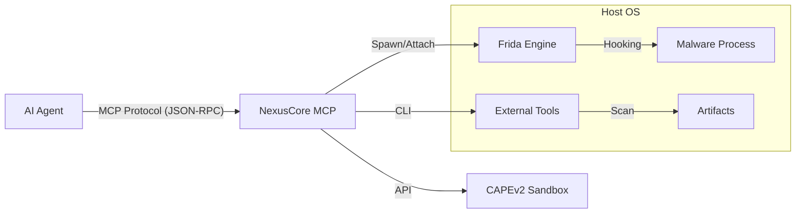

# NexusCore MCP

  

**NexusCore MCP** is an advanced **Model Context Protocol (MCP)** server tailored for **AI-driven dynamic malware analysis**. It bridges the gap between Large Language Models (LLMs) and low-level system instrumentation, allowing AI agents to actively debug, inspect, and analyze malware in real-time.

> **Why NexusCore?**
> Traditional sandboxes give you a report after the fact. NexusCore allows an AI to **interact** with the malware while it runs—bypassing anti-debugging checks using Frida, dumping memory, and reconstructing code on the fly.

---

## 🏗️ Architecture

NexusCore acts as a middleware between your AI Agent (Claude, Cursor, etc.) and the Host OS.



---

## 🚀 Features

### 🛡️ Malware Analysis Domain (`src/tools/malware/`)
| Tool | Description | Key Tech |
|------|-------------|----------|
| **`spawn_process`** | Launches malware in a **suspended state** to bypass early anti-debugging checks. | **Frida** |
| **`find_oep`** | Analyzes entry point instructions to detect unpacking loops and find OEP. | **Iced-x86** |
| **`cape_submit`** | Automates submission of samples to a **CAPEv2 Sandbox** and retrieves reports. | **Reqwest** |
| **`die_scan`** | Detects compilers, packers, and crypto signatures. | **Detect It Easy** |
| **`yara_scan`** | Scans files (and future implementation: memory) against YARA rules. | **YARA-rs** |
| **`pe_fixer`** | Parses PE headers and simulates OEP fixups for dumping. | **Goblin** |

### � Core Instrumentation (`src/tools/common/`)
| Tool | Description |
|------|-------------|
| **`attach_process`** | Attaches to an existing running process by PID. |
| **`read_memory`** | Reads raw bytes from a target process memory address. |
| **`install_hook`** | Injects custom JavaScript (Frida) to intercept API calls. |

---

## ⚡ Quick Start

### 1. Unified Environment Setup (Windows)
We provide an **All-in-One Powershell script** to install dependencies (Chocolatey, Python, Sysinternals, DIE, Capa, etc.).

Run as **Administrator**:
```powershell
./scripts/setup_tools.ps1
```

### 2. Configuration
Create a `.env` file in the root directory (copy from `.env.example`):

```ini
# .env
CAPE_API_URL=http://192.168.1.100:8000
CAPE_API_TOKEN=your_token_optional
RUST_LOG=info
```

### 3. Build & Run
```bash
cargo build --release
./target/release/nexuscore_mcp.exe
```

---

## 🤖 AI Integration Guide

To use NexusCore with your AI assistant, add it to your MCP client configuration.

### Claude Desktop / Cursor
Add to your `claude_desktop_config.json`:

```json
{
  "mcpServers": {
    "nexuscore": {
      "command": "C:\\Path\\To\\NexusCore_MCP\\target\\release\\nexuscore_mcp.exe",
      "args": [],
      "env": {
        "CAPE_API_URL": "http://127.0.0.1:8000"
      }
    }
  }
}
```

---

## 🛠️ Developer Guide

### Project Structure
- **`src/engine`**: Core Frida handler logic (Process spawning, Session management).
- **`src/tools`**: Plugin implementations.
    - **`common`**: General purpose system tools.
    - **`malware`**: Domain-specific security tools (Unpacker, Sandbox, etc.).
- **`src/sandbox`**: External sandbox API clients (CAPEv2).

### Running Tests
We have a comprehensive test suite including mock servers and binary parsing validation.

```bash
# Run all tests
cargo test

# Run specific domain tests
cargo test --test sandbox_tests
cargo test --test reconstruction_tests
```

---

## ⚠️ Disclaimer
This tool is intended for **authorized security research and malware analysis** only. The authors are not responsible for any misuse or damage caused by this software. Always run malware in an isolated Virtual Machine.

## License
MIT License